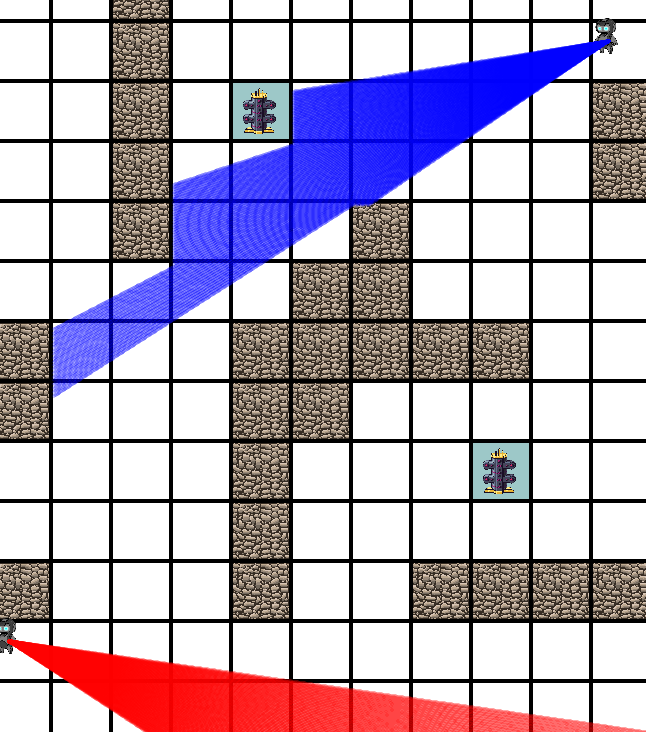
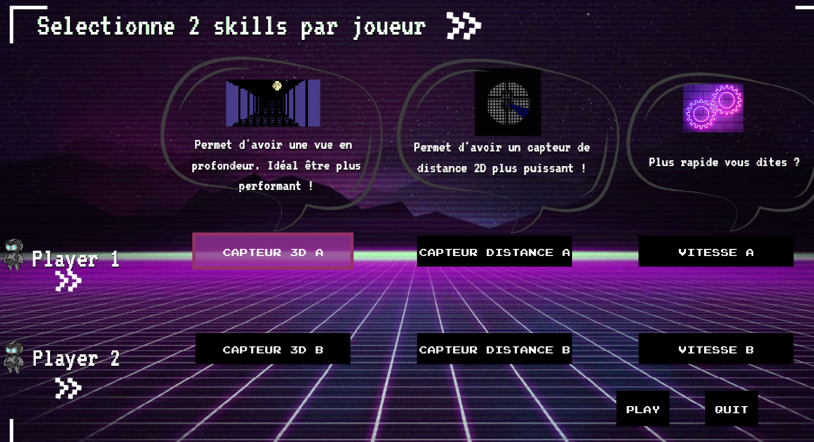
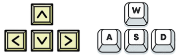
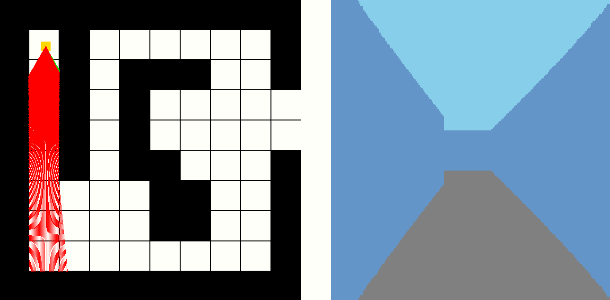

# Bienvenue sur Aie Robot !

Ce repository contient le code source du jeu Aie Robot !, un jeu de type Capture the Flag !, développé dans le cadre du projet de fin de semestre du cours de Programmation Orientée Objet (POO) de [Polytech Sorbonne](https://www.polytech.sorbonne-universite.fr/formations/robotique).


## Pré-requis
Ce jeu a été développé en C++ et utilise la bibliothèque SFML. Il est donc nécessaire d'avoir un compilateur C++ et d'installer la bibliothèque SFML. Ce jeu a été developpé sur Ubuntu 22.04.

**Pour installer SFML sur Ubuntu, taper dans un terminal :**

 ```sudo apt install libsfml-dev```


## Compilation et exécution
Pour obtenir le repository, il faut de cloner le repository git et compiler le code source. Pour cela, taper dans un terminal :

```$ git clone https://github.com/Vicktoria13/AIE_ROBOT.git ```

```$ cd src ```

```$ make ```

```$ ./main```

## But du jeu

Le jeu est le suivant :

C'est un jeu à deux joueurs, chaque joueur étant représenté par un robot. Le but, inspiré du simple jeu __Capture the Flag !__ est donc de recupérer le drapeau
ennemi avant lui. Un joueur perd si le second joueur remplit l'objectif avant lui.
 
Le jeu se déroule dans une carte 2D vu du dessus. Les robots sont contrôlables en direction via les touches du clavier.


Les flèches directionnelles Gauche et Droite permettent de naviger dans les écrans. La touche **Entrée** permet de valider un choix.

Ainsi, leur but est de naviguer dans une carte 2D jusqu'au drapeau ennemi et le toucher, tout cela en évitant les obstacles et ennemis :

- Les "murs", qui se dressent sur leur chemins

- des robots aimants : si le joueur est pris dans leur champ magnétique, alors ils sont bloqués pendant un certain temps.



## Choix des options de chaque robot

Au démarrage du jeu, chaque joueur doit selectionner 2 options (= skills). Il a le choix entre :

- Capteur Ultrasons : cette option permet au robot de se doter d'un capteur a ultrasons , lui permettant donc d'avoir une plus grande
vision du plateau 2D.

- Capteur 3D : cette option permet de donner au robot un capteur de type caméra 3D, lui permettant donc en plus de la vue 2D, d'obtenir une visualisation de la piste en 3D.

- Vitesse rapide : Cette option donne au robot des moteurs puissants, lui permettant de se déplacer plus vite par rapport a son ennemi.


 

Pour choisir, il faut naviger avec les touches gauche droite et valider avec la touche Entrée.

## Aide aux joueurs

De manière périodique, une lampe ponctuelle s'allumera de manière brève, laissant ainsi l'occasion aux deux joueurs de visulaiser le temps d'un court instant, ou se situe le drapeau ennemi !


## Controle du jeu

Chaque joueur maitrise 4 touches du clavier pour se déplacer dans l'environnement.

- les fleches directionnelles
- Les touches ZQSD



ainsi, les touches lattérales permettent de déplacer le champ de vision de chaque robot. Les touches du haut et bas, permettent respectivement d'avancer ou reculer selon la direction centrale du champ de vision.

Le gagnant du jeu est donc le premier joueur a toucher le drapeau ennemi.


## Remarque

Ce jeu se base notamment sur un algorithme de raycasting, permettant de simuler un champ de vision pour chaque robot. Il est possible d'en modifier les paramètres, notamment :

* le nombre de rayons
* la distance maximale de vision
* la distance minimale de vision
* l'angle de vision





## Documentation

Pour trouver la documentation du code source, il faut cliquer sur n'importe quel fichier html dans le dossier ```doc/html/```. Cela mennera à la documentation du code source, genérée avec Doxygen.